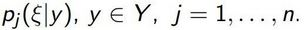
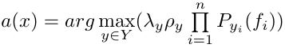
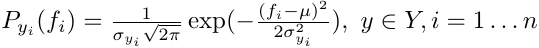
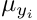
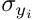
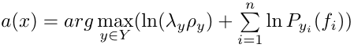

# Байесовские алгоритмы классификации


## [Линии уровня нормального распределения](./density_function_curves/)
**Вероятностное распределение с плотностью** 
называется n-мерным многомерным нормальном распределением 
с математическим ожиданием (центром) ,
и ковариационной матрицей .
Ковариационная матрица должна быть симметричной, невырожденной, положительно определённой.

### Геометрия нормальной плотности распределения
Рассмотрим случай двух признаков. 
Если признаки некоррелированны, то линия уровня плотности распределения имеет форму эллипсоида.
Если признаки имеют одинаковую дисперсию, то линия уровня плотности распределения имеет форму круга.
Если признаки коррелированы, то линия уровня плотности распределения имеют форму эллипсоида, оси которого повернуты относительно системы координат.

Характеристика | График
:---------:|:------------------:
Некоррелированные | 
С одинаковой дисперсией | 
Коррелированы | 

### Реализация на языке R
```r
line <- function(m,A)
{
	determ<-det(A)
	
	sol<-solve(A)
	
	c <- sol[1,1]
	d <- sol[1,2]
	e <- sol[2,1]
	f <- sol[2,2]
	
	g <- m[1]
	h <- m[2]
	
	x <- seq(-2.5, 2.5, 0.1)
	y <- seq(-2.5, 2.5, 0.1)
	
	A <- c
	B <- f
	C <- e+d
	D <- -2*g*c-h*e-h*d
	E <- -2*h*f-g*e-g*d
	F <- g*g*c-g*h*e+g*h*d+h*h*f
	
	func <- function(x, y) {
	  1/(2*pi*sqrt(determ))*exp((-1/2)*(x^2*A + y^2*B + x*y*C + x*D + y*E + F))
	}
	
	z <- outer(x, y, func)
	
	contour(x, y, z)
}
```

## [Наивный байесовский классификатор](./naive_baes/)
Будем полагать, что все объекы описываются **n** независимыми числовыми признаками **f<sub>j</sub>**.
Признаки **f<sub>j</sub>**: **X** → **D<sub>j</sub>**  независимые случайные величины
с плотностями распределения, , 

Тогда алгоритм нормального наивного байесовского классификатора представим в виде произведения одномерных плотностей по признакам:
.

Для вычисления плотности распределения воспользуемся формулой гауссовской плотности:
,
где  - мат. ожидание i-того признака, а   - дисперсия i-того признака для класса y.

Для удобства прологарифмируем выражение, в таком случае классификатор приобретает вид:


### Реализация на языке R
```r

```

### Пример классификации