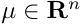
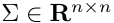
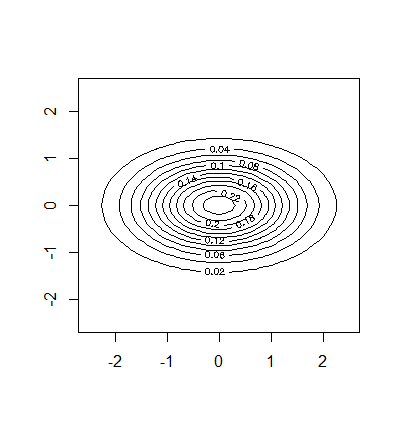
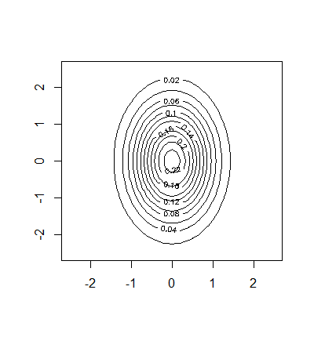
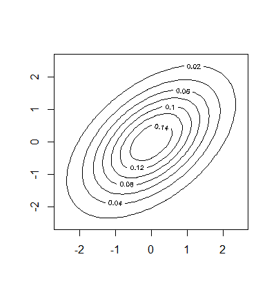

# Метрические алгоритмы классификации


## [Линии уровня нормального распределения](./density_function_curves/)
**Вероятностное распределение с плотностью** 
называется n-мерным многомерным нормальном распределением 
с математическим ожиданием (центром) ,
и ковариационной матрицей .
Ковариационная матрица должна быть симметричной, невырожденной, положительно определённой.

### Геометрия нормальной плотности распределения
Рассмотрим случай двух признаков. 
Если признаки некоррелированны, то линия уровня плотности распределения имеет форму эллипсоида.
Если признаки имеют одинаковую дисперсию, то линия уровня плотности распределения имеет форму круга.
Если признаки коррелированы, то линия уровня плотности распределения имеют форму эллипсоида, оси которого повернуты относительно системы координат.

Характеристика | График
:---------:|:------------------:
Некоррелированные | 
С одинаковой дисперсией | 
Коррелированы | 

### Реализация на языке R
```r
line <- function(m,A)
{
	determ<-det(A)
	
	a <- A[2,2]/determ
	b <- -A[2,1]/determ
	c <- -A[1,2]/determ
	d <- A[1,1]/determ
	
	x0 <- m[1]
	y0 <- m[2]
  
	x <- seq(-2.5, 2.5, 0.1)
	y <- seq(-2.5, 2.5, 0.1)
	
	A <- d
	B <- a
	C <- -c-b
	D <- -2*d*x0+y0*(c+b)
	E <- -2*a*y0+x0*(c+b)
	F <- d*x0^2+a*y0^2+x0*y0*(-c-b)
	
	func <- function(x, y) {
    	1/(2*pi*sqrt(determ))*exp((-1/2)*(x^2*A + y^2*B + x*y*C + x*D + y*E + F))
	}
	
	z <- outer(x, y, func)
  
	contour(x, y, z)
}
```