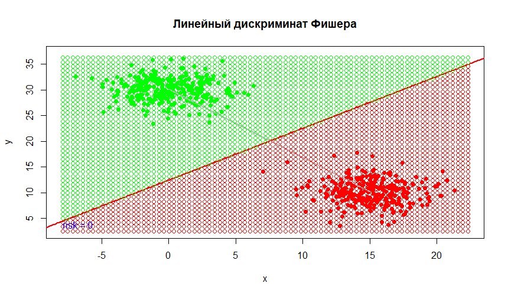

# Байесовские алгоритмы классификации
**Байесовские алгоритмы классификации** основаны на предположении, что есть вероятностное пространство  с неизвестной плотностью распределения , из которого случайно и независимо извлекаются *l* наблюдений.

Байесовский подход опирается на теорему о том, что **если плотности распределения классов известны, то алгоритм классификации, имеющий минимальную вероятность ошибок, можно выписать в явном виде**.

Обозначим *величину потери* алгоритмом *а* при неправильной классификации объекта класса *y* .

**Теорема:** Если известны априорные вероятности классов *P(y)* и функции правдоподобия *p(x*|*y)*, то минимум среднего риска достигается алгоритмом . Алгоритм *a(x)* называется **оптимальным байесовским решающим правилом**.

На практике зачастую плотности распределения классов неизвестны и их приходится восстанавливать по обучающей выборке. **Чем лучше удастся восстановить функции правдоподобия, тем ближе к оптимальному будет построенный алгоритм**.

В зависимости от способов восстановления плотности существует большое разнообразие **байесовских алгоритмов классификации**.

## [Линии уровня нормального распределения](./density_function_curves/)
**Вероятностное распределение с плотностью** 
называется n-мерным многомерным нормальном распределением 
с математическим ожиданием (центром) ,
и ковариационной матрицей .
Ковариационная матрица должна быть симметричной, невырожденной, положительно определённой.

### Геометрия нормальной плотности распределения
Рассмотрим случай двух признаков. 
Если признаки некоррелированны, то линия уровня плотности распределения имеет форму эллипсоида.
Если признаки имеют одинаковую дисперсию, то линия уровня плотности распределения имеет форму круга.
Если признаки коррелированы, то линия уровня плотности распределения имеют форму эллипсоида, оси которого повернуты относительно системы координат.

Характеристика | График
:---------:|:------------------:
Некоррелированные | 
С одинаковой дисперсией | 
Коррелированы | 

### Реализация на языке R
```r
line <- function(m,A)
{
	determ<-det(A)
	
	sol<-solve(A)
	
	c <- sol[1,1]
	d <- sol[1,2]
	e <- sol[2,1]
	f <- sol[2,2]
	
	g <- m[1]
	h <- m[2]
	
	x <- seq(-2.5, 2.5, 0.1)
	y <- seq(-2.5, 2.5, 0.1)
	
	A <- c
	B <- f
	C <- e+d
	D <- -2*g*c-h*e-h*d
	E <- -2*h*f-g*e-g*d
	F <- g*g*c-g*h*e+g*h*d+h*h*f
	
	func <- function(x, y) {
	  1/(2*pi*sqrt(determ))*exp((-1/2)*(x^2*A + y^2*B + x*y*C + x*D + y*E + F))
	}
	
	z <- outer(x, y, func)
	
	contour(x, y, z)
}
```

## [Наивный нормальный байесовский классификатор](./naive_baes/)
Будем полагать, что все объекы описываются **n** независимыми числовыми признаками **f<sub>j</sub>**.
Признаки **f<sub>j</sub>**: **X** → **D<sub>j</sub>**  независимые случайные величины
с плотностями распределения, , 

Тогда алгоритм нормального наивного байесовского классификатора представим в виде произведения одномерных плотностей по признакам:
.

Для вычисления плотности распределения воспользуемся формулой гауссовской плотности:
,
где  - мат. ожидание i-того признака, а   - дисперсия i-того признака для класса y.

Для удобства прологарифмируем выражение, в таком случае классификатор приобретает вид:


### Реализация на языке R
```r
getPyj <- function(x, M, D){
  return( (1/(D*sqrt(2*pi))) * exp(-1 * ((x - M)^2)/(2*D^2)) )
}

getNaiveBayesFunc <- function(means,vars)
{
  n <- dim(means)[1]
  funcs <- list()
  Prob <- rep(0.5,n)
  Prior <- rep(0.5,n)
  makefunc <- function(i) {
    force(i)
    function(X)
    { 
      res <- log(Prob[i] * Prior[i])
      
      for (j in seq(n)) {
        p <- getPyj(X[j], means[j,i],vars[j,i])
        res <- res + log(p)
      }
      return(res)
    }
  }
  for(i in seq(n))
  {
    funcs[[i]] <- makefunc(i)
  }
  
  solvingFunc <- function(X)
  {
    results <- vector()
    for (i in seq(n))
    {
      results[i] <- funcs[[i]](X)
    }
    #print (results)
    return(which.max(results))
  }
  return(solvingFunc)
}

bayesSolvingFunc <- getNaiveBayesFunc(means,vars)
bayesSolvingFunc(X)

```

### Пример классификации


## [Подстановочный	алгоритм (plug-in)](./plug_in/)

Постановочный алгоритм
Если мы оценим параметры функции правдоподобия  и  по частям обучающей выборки  для каждого класса , а затем эти выборочные оценки подставим в оптимальный байесовский классификатор, то получим подстановочный алгоритм **plug-in**. 

Это байесовский нормальный классификатор оценки параметров гауссовской плотности, которого имеют вид:


### Реализация на языке R
```r
getPlugInClassificator <- function(Prob = c(1),Prior = c(2),means,vars)
{
  n <- dim(means)[1]
  funcs <- list()
  
  makefunc <- function(i) {
    force(i)
    function(X)
    { 
      res <- Prob[i] * Prior[i]
      l <- length(X)
      chisl <- exp(
        (-1/2)*(
          t(X-as.vector(means[,i])) %*% solve(vars[[i]]) %*% (X-as.vector(means[,i]))
        )
      )
      res <- res * chisl/((2*pi) * det(vars[[i]])^(1/2))
      
      return(res)
    }
  }
  for(i in seq(n))
  {
    funcs[[i]] <- makefunc(i)
  }
  
  solvingFunc <- function(X)
  {
    results <- vector()
    for (i in seq(n))
    {
      results[i] <- funcs[[i]](X)
    }
    return(which.max(results))
  }
  return(solvingFunc)
}
mu1 <- matrix(c(mean(xy1[,1]),mean(xy1[,2])),1,2)
mu2 <- matrix(c(mean(xy2[,1]),mean(xy2[,2])),1,2)

sigma1 <- var(xy1)
sigma2 <- var(xy2)


means<-matrix(c(mu1,mu2),length(mu1),2)
vars<-list()
vars[[1]]<-sigma1
vars[[2]]<-sigma2

plug_in_func <- getPlugInClassificator(rep(1,length(vars)),rep(1,length(vars)),means = means, vars = vars)
xy <- c(x,y)
#возвращает номер класса согласно переданных мат.ожиданий и дисперсий.
plug_in_func(xy) 

```

### Пример классификации и разделяющей кривой

Cлучай, когда разделяющая кривая является **эллипсом**.


Cлучай, когда разделяющей кривой является **парабола**.


Cлучай, когда разделяющей кривой является **гипербола**.


## [Линейный дискриминант Фишера - ЛДФ](./LDF/)
Линейный дискриминант Фишера похож на подстановочный алгоритм, но имеет отличие в том, что мы предполагаем равенство ковариационных матриц, тогда алгоритм классификации примет вид:


где


Разделяющая поверхность задается так же как в подстановочном алгоритме, но имеет отличие в том что используются две одинаковые ковариационные матрицы для нахождение коэффициентов уровнения разделяющей поверхности.


### Реализация на языке R
```r
  n <- dim(means)[1]
  funcs <- list()
  
  makefunc <- function(i) {
    force(i)
    function(X)
    { 
      res <- log(Prob[i] * Prior[i])
      l <- length(X)
      a <- 
        (-1/2)*(
          t(as.vector(means[,i])) %*% solve(vars) %*% (as.vector(means[,i]))
        
      )
      b <- 
        t(as.vector(means[,i])) %*% solve(vars) %*%  (X)
        
      res <- res + a + b
      
      return(res)
    }
  }
  for(i in seq(n))
  {
    funcs[[i]] <- makefunc(i)
  }
  
  solvingFunc <- function(X)
  {
    results <- vector()
    for (i in seq(n))
    {
      results[i] <- funcs[[i]](X)
    }
    
    return(which.max(results))
  }
  return(solvingFunc)
}
mu1 <- matrix(c(mean(xy1[,1]),mean(xy1[,2])),1,2)
mu2 <- matrix(c(mean(xy2[,1]),mean(xy2[,2])),1,2)

sigma1 <- var(xy1)
sigma2 <- var(xy2)

means<-matrix(c(mu1,mu2),length(mu1),2)
vars<-list()
vars[[1]]<-sigma1
vars[[2]]<-sigma2

LDFClassificator <- getLDFClassificator(rep(1,length(sigma1)),rep(2,length(sigma1)),means = means, vars = sigma1)
xy <- c(x,y)

#возвращает номер класса согласно переданных мат.ожиданий и дисперсий.
LDFClassificator(xy) 

```

### Пример разделяющей прямой и карты классификации


