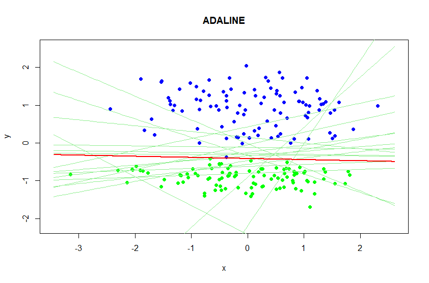

# Линейные алгоритмы классификации
Пусть . **Линейным** называется следующий алгоритм классификации:

 ,
где  -- вектор параметров.

Гиперплоскость, разделяющая классы в пространстве , задаётся уравнением **<w, x> = 0**. Если вектор *x* находится по одну сторону гиперплоскости с её направляющим вектором *w*, то объект *x* относится к классу +1, иначе -- к классу -1.

Для того, чтобы подобрать оптимальный вектор параметров *w*, минимизирующий эмпирический риск  ,

применяется **метод стохастического градиента**. В этом методе сначала выбирается начальное приближение для *w* (инициализируется небольшими случайными значениями *w = (-1/2n, 1/2n)*, где *n* -- число признаков *x*), затем запускается итерационный процесс, на каждом шаге которого вектор *w* сдвигается в направлении, противоположном направлению вектора градиента .

### Реализация метода стохастического градиента на языке R
```r
stgrad <- function(xl, eta = 1, lambda = 1/6, eps = 1e-7, loss, upd, ...) {
  l <- dim(xl)[1]
  n <- dim(xl)[2] - 1
  w <- rep(0.5, n)
  
  Q <- 0
  Qprev <- Q
  
  # Начальное значение Q
  for (i in seq(l)) {
    xi <- xl[i, 1:n]
    yi <- xl[i, n+1]
    
    Q <- Q + loss(xi, yi, w)
  }
  
  iter <- 0
  repeat {
    #ограничение количества повторов
    iter <- iter + 1
    if (iter > 10000) {
      break
    }
    
    mis <- array(dim = l)
    for (i in seq(l)) {
      xi <- xl[i, 1:n]
      yi <- xl[i, n + 1]
      
      mis[i] <- crossprod(w, xi) * yi
    }
    
    errorIndexes <- which(mis <= 0)
    if (length(errorIndexes) == 0) {
      break
    }
    
    i <- sample(errorIndexes, 1)
    xi <- xl[i, 1:n]
    yi <- xl[i, n + 1]
    
    ex <- loss(xi, yi, w)
    
    w <- upd(xi, yi, w, eta)
    
    Q <- (1 - lambda) * Q + lambda * ex
    
    if (abs(Q - Qprev) < eps) {
      break
    }
    Qprev <- Q
    
    #drawLine(w, ...)
  }
  
  return(w)
}
```

## ADALINE
ADALINE (адаптивны линейный элемент) -- линейный алгоритм классификации. 
В качестве функции потерь используется квадратичная функция потерь: ,
Обучение ADALINE заключается в подборе "наилучших" значений вектора весов w. Какие значение весов лучше определяет функционал потерь. В ADALINE используется функционал, предложенный Видроу и Хоффом,. Таким образом необходимо минимизировать функционал  - .

Для минимизации Q(w) будем использовать метод стохастического градиентного спуска.


### Реализация на языке R
```r
 
# Квадратичная функция потерь для ADALINE
adaLoss <- function(xi, yi, w) {
  mi <- c(t(w) %*% xi) * yi
  l <- (mi - 1)^2
  return(l)
}
# дельта правило обновления для ADALINE
adaUpd <- function(xi, yi, w, eta) {
  wx <- c(t(w)%*% xi)
  #ld <- 2 * (wx - yi) * xi
  ld <- (wx - yi) * xi
  nextW <- w - eta * ld
  return(nextW)
}

getADALINEClassificator <- function(dat)
{
  resAda <- stgrad(dat, loss = adaLoss, upd = adaUpd)
  drawLine(resAda, lwd = 2, col = 'red', xmin = plotxmin, xmax = plotxmax)
  getValue <- function(x) {
    sigmoid <- function(z) {
      return (1 / (1 + exp(-z)))
    }
    return ( sigmoid(c(crossprod(resAda, c(x[1], x[2], -1))) * -1) - sigmoid(c(crossprod(resAda, c(x[1], x[2], -1))) * 1) )
  }
  
  solvingFunc <- function(X)
  {
    pp <- getValue(X)
    if (pp > 0) 
    {
      return(1)
    }
    else 
    {
      return(2)
    }
  }
  return(solvingFunc)
}
adalineClassificator <- getADALINEClassificator(dat)
## возвращае номер класса
classnum <- adalineClassificator(X)
```


### Визуализация гиперплоскости


### Процесс обучения



### Карта класификации


## Правило Хебба

## Логистическая регрессия
