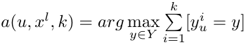
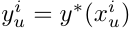

# Метрические алгоритмы классификации


## [Алгоритм ближайших соседей](./alg_NN/)
**Алгоритм kNN** - метрический алгоритм классификации, основанный на оценивании сходства объектов. Классифицируемый объект относится к тому классу, которому принадлежат ближайшие к нему объекты обучающей выборки.

### Формула алгоритма kNN:


где  ответ на i-ом соседе,
а k - параметр (количество соседей), который определяет, сколько объектов (соседей) будет использовано для классификации.

### Реализация алгоритма на языке R
```r
kNN <- function(xl, z, k = c(6))
{
 orderedXl <- sortObjectsByDist(xl, z)
  n <- dim(orderedXl)[2] - 1
  classes <- orderedXl[1:k[length(k)], n + 1]

  class <- c(seq(length(k)))

  for (i in seq(length(k)))
  {
	counts <- table(orderedXl[1:i,n+1])
	class[i] <- names(which.max(counts))
  }
1
  return (class)
}
```
