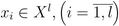

# Метрические алгоритмы классификации


## [Алгоритм kNN](./alg_NN/)
**Алгоритм kNN** - метрический алгоритм классификации, основанный на оценивании сходства объектов. Классифицируемый объект относится к тому классу, которому принадлежат ближайшие к нему объекты обучающей выборки.

### Формула алгоритма kNN:


где  ответ на i-ом соседе,
а k - параметр (количество соседей), который определяет, сколько объектов (соседей) будет использовано для классификации.

### Реализация алгоритма на языке R
```r
kNN <- function(xl, z, k = c(6))
{
 orderedXl <- sortObjectsByDist(xl, z)
  n <- dim(orderedXl)[2] - 1
  classes <- orderedXl[1:k[length(k)], n + 1]

  class <- c(seq(length(k)))

  for (i in seq(length(k)))
  {
	counts <- table(orderedXl[1:i,n+1])
	class[i] <- names(which.max(counts))
  }
  
  return (class)
}
```

### По критерию скользящего контроля LOO оптимальное k = 6:


### Карта классификации kNN


## [Алгоритм kwNN](./alg_NN/)

При взвешенном способе во внимание принимается не только количество попавших в область определённых классов, но и их удалённость от нового значения. Для каждого класса определяется оценка близости. У какого класса выше значение близости, тот класс и присваивается новому объекту.

### Формула алгоритма kwNN выглядит следующим образом

где w(i) - функция веса, которая показывает насколько сильно i-ый объект влияет на принадлежность классифицируемого объекта к классу u; функция представляет собой геометрическую прогрессию с параметром q из диапазона [0; 1] (например: w(i) = q^i).

### Реализация алгоритма на языке R
```r
kwNN <- function(xl, z, k, q)
{
  orderedXl <- sortObjectsByDist(xl, z)
  n <- dim(orderedXl)[2]
  
  classes <- orderedXl[1:length(k), n]
  
  lvls <- levels(classes)
  
  weighted_classes <- cbind(as.matrix(classes),q^as.numeric(1:length(k))) 
  class <- vector()
  for (i in seq(length(k)))
  {
    curr <- as.matrix(weighted_classes[1:i,])
    if(i == 1)
      curr <- t(curr)
    result <- as.matrix(sapply(1:length(lvls), function(x) sum(as.numeric(curr[which(curr[,1] == lvls[x]),2]))))
    
    class[i] <- lvls[which.max(result)]
  }
  
  return (class)
}
```

### По критерию скользящего контроля LOO оптимальное k = 6 и q = 1:


### Карта классификации kwNN


###Преимущество	метода kwNN над kNN

Преимуществом метода kwNN заключается в том, что kNN  не учитывает порядок соседей классифицируемого объекта. В случае, если даны 2 касса объектов с разной плотностью распределения, алгоритм kwNN будет относить объекты, находящиеся на границе двух классов к тому классу, чьи объекты расположены плотнее к классифицируемому. 

***Пример:***

Классификация объекта A(2, 0.4) при k=7:

kNN | kWNN
:------------:|:----------------------:
|


## [Метод парзеновского окна](./alg_parsen/)

**Метод парзеновского окна** — метод классификации, основанный на непараметрическом восстановлении плотности по имеющейся выборке. В основе подхода лежит идея о том, что плотность выше в тех точках, рядом с которыми находится большое количество объектов выборки. В данном алгоритме выбирается следующий способ задать веса соседям: определить ***w(i)***, а не от ранга соседа.

***Формула Парзеновского окна выглядит следующим образом:***
 
где ***K(x)*** -- невозрастающая на [0; ∞) функция ядра,
а ***h*** -- параметр (ширина окна).
Если плотность объектов в пространстве неоднородна, то имеет смысл использовать переменную ширину окна, тогда формула приобретает следующий вид:
 

Реализация алгоритма на языке **R**:
```
parsen <- function(dat, z, h=c(0.35), kerF = RectKer) {
  n <- dim(dat)[2]
  m <- dim(dat)[1]
  datWithDist <- DistanceToDataFrame(dat, z)
  
  classifiedObjects <- rep("", length(h))
  
  for(i in seq(length(h)))
  {
    classes <- rep(0, length(names(table(dat[,n]))))
    names(classes) <- names(table(dat[,n]))
    
    for(j in 1:m){
      y <- datWithDist[j, n]
      w <- kerF(datWithDist[j,4]/h[i])
      classes[y] <- classes[y] + w
    }
    if(sum(classes) > 0) {
      class <- names(which.max(classes))
    } else {
      class <- "unknown"
    }
    classifiedObjects[i] = class
  }
  return(classifiedObjects)
}
```

**Используя различные ядра найдем оптимальные значения параметра h, построим график критерия скользящего контроля LOO, построим карту классификации**

Ядро | Оптимальное *h* и значение LOO | График LOO(h)
:---:|:---------:|:------------------:
Прямоугольное | h=0.35 LOO=0.04 |  
Треугольное | h=0.35 LOO=0.04 |  
Квартическое | h=0.35 LOO=0.04 |  
Епанечникова | h=0.35 LOO=0.04 |  
Гауссовское | h=0.1 LOO=0.04 |  

## [Метод потенциальных функций](./alg_potential/)

Метод потенциальных функций - относится к метрическим классификаторам. В отличии от метода парзеновских окон, окно строится вокруг обучающих точек. При классификации объект проверяется на близость к объектам из обучающей выборки. Простыми словами, объекты из обучающей выборки «заряжены» своим классом, а вес каждого из них при классификации зависит от «заряда» и расстояния до классифицируемого объекта.

Метод потенциальных функций заключается в выборе в качестве w(i,u) весовой функции следующего вида:
***w(i,u)***=, где

 — функция, убывающая с ростом аргумента. Константа a нужна чтобы избежать проблем с делением на ноль. Для простоты обычно полагают a=1.

 — расстояние от объекта u до i-того ближайшего к u объекта — .

 — параметр, задающий «ширину потенциала» объекта . Вводится по аналогии с шириной окна в методе парзеновского окна.

 — параметр, задающий «заряд», то есть степень «важности» объекта  при классификации.
